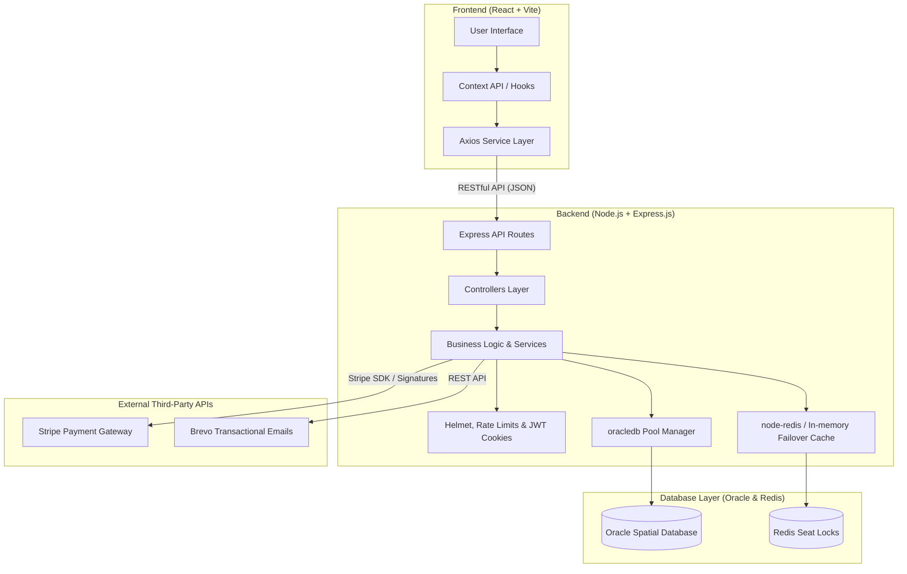
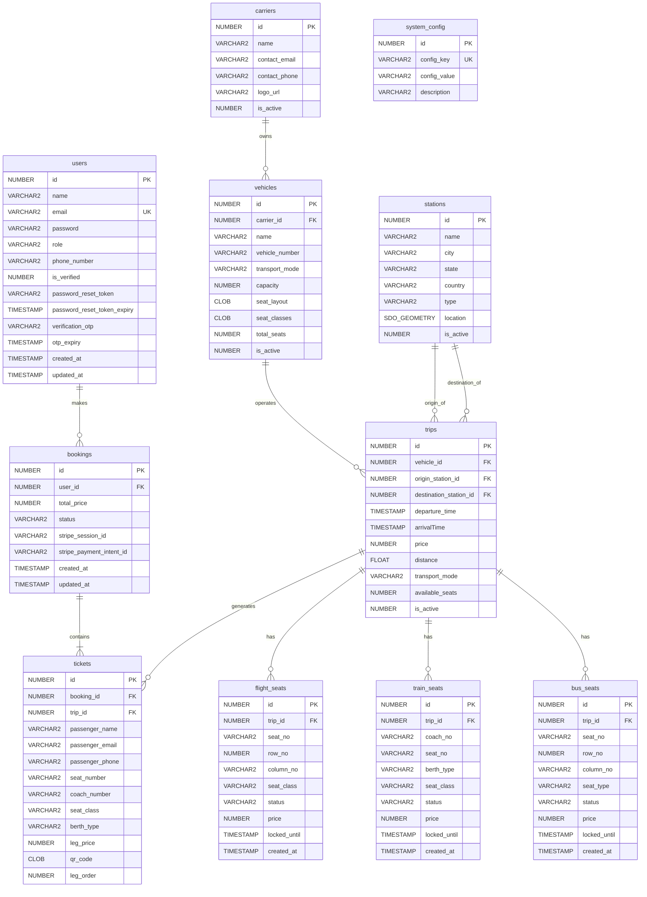

# 🚀 TripLine: The Future of Multi-Modal Travel

> **TripLine** is a premium, full-stack travel booking ecosystem designed for seamless journey planning across **Flights, Trains, and Buses**. Fully migrated from Spring Boot to a highly performance-optimized **Node.js/Express.js** backend, backed by **Oracle Database (with Spatial indexing)** and a dynamic **React** frontend, it offers a state-of-the-art booking and routing experience for modern travelers.

---

## 🏗️ System Architecture

TripLine is built upon a decoupled, secure **Client-Server Architecture** designed for high throughput, session security, and robust service failover.



---

## 🗄️ Database Management System (DBMS) Perspective

The system architecture is backed by a highly normalized relational schema designed for **Data Integrity** and **High-Performance Spatial Querying**.

### 📊 Entity-Relationship (ER) Diagram



### 🛰️ Oracle Spatial Geometry Integration
To support advanced routing calculations, geographic coordination of Stations uses **Oracle Spatial (`MDSYS.SDO_GEOMETRY`)** representing GPS coordinates (`SRID 4326`). Spatial query execution is accelerated using custom R-Tree Indexes (`MDSYS.SPATIAL_INDEX_V2`).

---

## 🚀 Key Features

*   **Multi-Modal Search & Routing**: Single search interface powered by a custom Dijkstra multi-modal pathfinding algorithm that navigates trips and connections with layover logic.
*   **Interactive Seat Selection**: Vector layouts (Flights, Trains, Buses) allowing users to select berths (upper, lower, side) or seat alignments (window, aisle) with real-time feedback.
*   **Temporary Seat Locking**: Utilizes Redis for sub-second seat holding during checkout. Features a robust fallback to an in-memory cache to guarantee zero-downtime if Redis is unavailable.
*   **Secure Authentication**: Implemented via secure, cross-origin HTTP-Only Cookies storing signed JSON Web Tokens (JWT).
*   **Stripe checkout Integration**: Built-in webhook signature verification confirming bookings, capturing seat logs, and generating tickets instantly.
*   **PDF Tickets with Base64 QR codes**: Generated dynamically in the backend using PDFKit and cached as Base64-encoded strings for responsive user viewing and offline verification.
*   **Transactional Notifications**: Auto-delivery of booking confirmations, Stripe invoices, and OTP verification codes powered by Brevo REST API.

---

## 🛠️ Technology Stack

| Component | Technology | Description |
| :--- | :--- | :--- |
| **Frontend** | React 18, Vite, Tailwind CSS, Axios, Lucide Icons | Client-side responsive SPA |
| **Backend** | Node.js, Express.js | Modular REST API Server |
| **Database** | Oracle Database (oracledb) | Primary relational database with Spatial capabilities |
| **Caching** | Redis (node-redis) | Seat map lock manager |
| **PDF Engine** | PDFKit | Vector-based PDF Generator |
| **Security** | Helmet, express-rate-limit, cookie-parser | API request security hardening |
| **Payments** | Stripe SDK | Checkout sessions and Webhook listeners |

---

## 📦 Installation & Setup

### Prerequisites
*   Node.js 18+
*   Oracle Database instance (local or remote)
*   Redis server (optional, falling back to in-memory)

### 1. Environment Configuration
Create a `.env` file in the **root** folder containing the following:
```env
# Database Settings
DATABASE_URL=jdbc:oracle:thin:@<host>:<port>/<service>
DATABASE_USERNAME=your_username
DATABASE_PASSWORD="your_password"
Hostname=your_host
Port=1521
Service_Name=your_service

# Redis Setup
REDIS_URL=redis://localhost:6379

# Security Tokens
JWT_SECRET=your_jwt_secret_key_at_least_32_characters

# Stripe Payments
STRIPE_SECRET_KEY=sk_test_...
STRIPE_WEBHOOK_SECRET=whsec_...

# Brevo SMTP API
BREVO_API_KEY=xkeysib-...
BREVO_SENDER_EMAIL=your_verified_sender@email.com

# Frontend Configuration
FRONTEND_URL=http://localhost:5173
```

### 2. Database Cleanup & Setup
To clean and set up your Oracle Database tables, run the built-in database reset script:
```bash
cd server
npm run db-reset   # Drops existing tables, registers spatial metadata, and recreates the schema
```
*Note: The raw database setup script is also available in [server/schema.sql](file:///c:/Users/evanc/Desktop/Tripline_v2/server/schema.sql) for manual execution.*

### 3. Running the Application

#### Start the Backend Server
```bash
cd server
npm install
node src/app.js   # Server runs on port 8080
```

#### Start the Frontend Client
```bash
cd client
npm install
npm run dev       # Client runs on port 5173
```

---
*Developed with ❤️ by the TripLine Team.*
