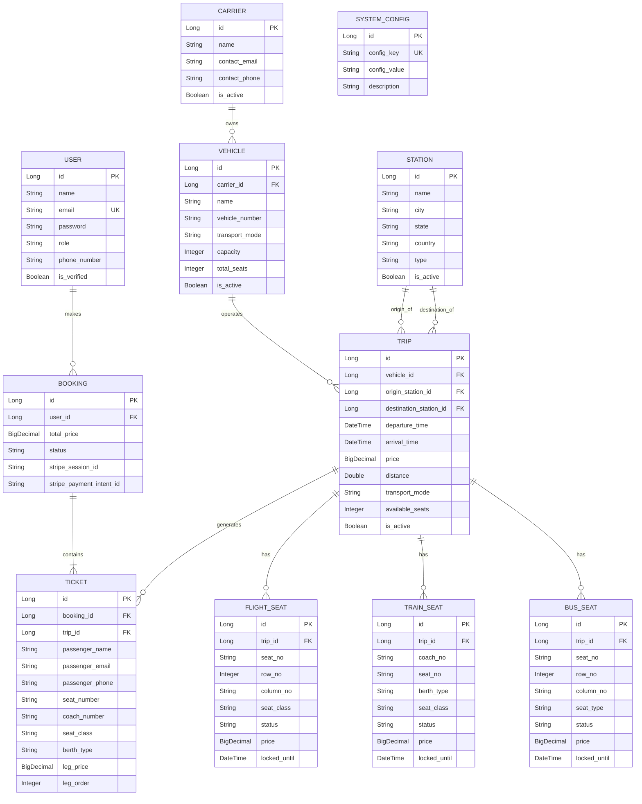
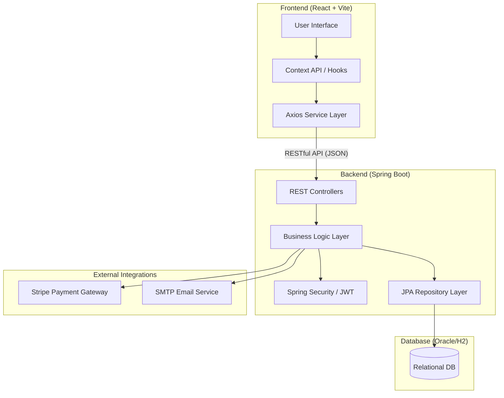

# 🚀 TripLine: The Future of Multi-Modal Travel

> **TripLine** is a premium, full-stack travel booking ecosystem designed for seamless journey planning across **Flights, Trains, and Buses**. Built with a robust **Spring Boot** backend and a high-performance **React** frontend, it offers a state-of-the-art experience for modern travelers.

---

## 🎨 Human-Computer Interaction (HCI) Perspective

TripLine is engineered with **User-Centric Design** at its core. Our interface adheres to industry-standard HCI principles to ensure maximum usability and delight.

### 🧠 Core HCI Principles Applied
*   **Visibility of System Status**: Real-time seat availability and booking progress indicators (e.g., interactive seat maps).
*   **Consistency & Standards**: A unified design language across all transport modes, ensuring users don't have to relearn the interface for different bookings.
*   **Error Prevention**: Smart validation on search inputs (e.g., date pickers that prevent past-date selection) and confirmation modals before financial transactions.
*   **Aesthetic & Minimalist Design**: A "Premium Dark/Light" theme that prioritizes essential information, reducing cognitive load during complex trip planning.
*   **Help & Documentation**: Integrated "DocPage" providing clear guidance on system features.

---

## 🗄️ Database Management System (DBMS) Perspective

The system architecture is backed by a highly normalized relational schema designed for **Data Integrity** and **High-Performance Querying**.

### 📊 Entity-Relationship (ER) Diagram

### 🔐 Data Integrity & Scalability
- **Transactional Integrity**: ACID properties are strictly maintained during the seat reservation process using Spring Data JPA's `@Transactional` scope.
- **Indexing Strategy**: Optimized lookup for scheduled trips using composite indexes on `(origin_station_id, destination_station_id, departure_time)`.
- **Constraint Management**: Foreign key constraints ensure referential integrity across Stations, Vehicles, and Trips.

---

## 🏗️ System Architecture

TripLine follows a decoupled **Client-Server Architecture** optimized for scalability and security.

---

## 🚀 Key Features
- **Multi-Modal Search**: Single search bar for Flights, Trains, and Buses.
- **Interactive Seat Selection**: Visual SVG-based seat selection for all vehicles.
- **Dynamic Pricing**: Real-time fare calculation based on journey distance and mode.
- **Admin Command Center**: Complete dashboard for managing carriers, vehicles, and system configurations.
- **JWT Security**: Robust authentication with secure cookie-based session management.

---

## 🛠️ Tech Stack
- **Frontend**: React 18, Tailwind CSS, Lucide Icons, Framer Motion.
- **Backend**: Java 17, Spring Boot 3.x, Spring Security, JWT, Lombok.
- **Persistence**: Hibernate/JPA, Oracle SQL / PostgreSQL.
- **Infrastructure**: Vercel (Frontend), Render (Backend), Maven.

---

## 📦 Installation & Setup

### Prerequisites
- JDK 17+
- Node.js 18+
- Maven 3.x

### Backend Setup
1. Navigate to `/backend`
2. Configure `.env` with your DB credentials and Stripe keys.
3. Run `mvn spring-boot:run`

### Frontend Setup
1. Navigate to `/frontend`
2. Run `npm install`
3. Run `npm run dev`

---
*Developed with ❤️ by the TripLine Team.*
